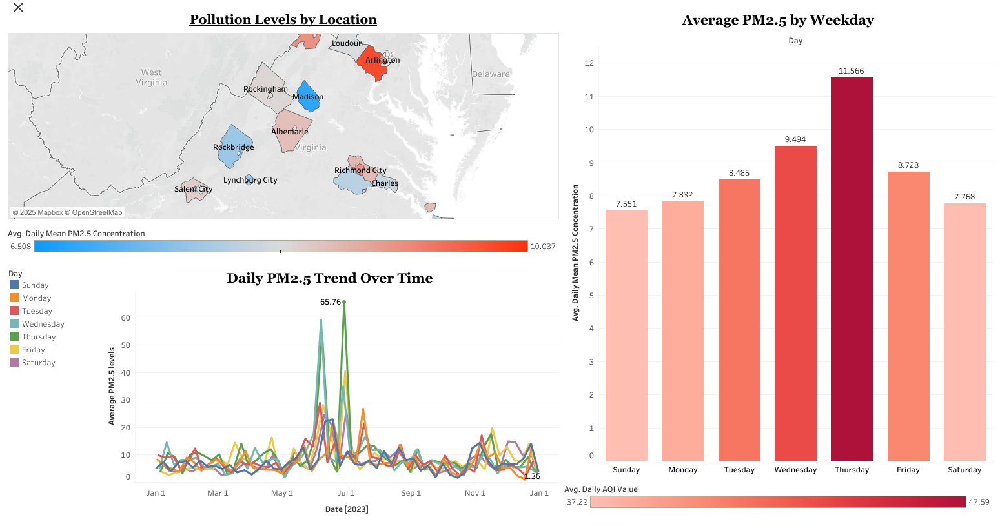

# Virginia Air Quality Dashboard (PM2.5) – Tableau Project

This project visualizes air pollution trends across Virginia using PM2.5 data from the EPA's Air Quality System (AQS) for the year 2023. It combines time-series, categorical, and geographic views to explore how air quality varies by **date**, **weekday**, and **county**.

---

## Dataset Summary

- **Source**: [EPA Air Quality System (AQS)](https://www.epa.gov/aqs)
- **Pollutant Tracked**: PM2.5 (Particulate Matter ≤2.5 microns)
- **Scope**: Daily pollution readings from 20+ monitoring sites across Virginia
- **Fields Used**: Date, Day of Week, PM2.5 Concentration, AQI Value, County, Site Coordinates

Data was cleaned and pre-processed in **Excel**, then visualized using **Tableau Public**.

---

## Dashboard Preview

📍 [View interactive dashboard on Tableau Public](https://public.tableau.com/views/air_quality_workbook_dashboard/VirginiaAirQualityAnalysis2023?:language=en-US&:sid=&:redirect=auth&:display_count=n&:origin=viz_share_link)

---

## 🔎 Chart-by-Chart Insights

### **1.** **Pollution Levels by Location (Filled Map)**
- Counties like **Arlington** and **Frederick** show **higher PM2.5 levels**
- **Madison** and **Rockbridge** maintain **cleaner air**
- Urbanization, traffic, and industrial activity likely influence this pattern

---

### **2.** **Daily PM2.5 Trend Over Time (Line Chart)**
- PM2.5 levels peaked in **late spring to early summer** (May–June)
- Several spikes exceed **50 μg/m³**, suggesting possible events (e.g., wildfires, stagnant air)
- Overall trend is **moderate with periodic spikes**

---

### **3.** **Average PM2.5 by Weekday (Bar Chart)**
- **Thursday** has the highest average pollution level: **11.57 μg/m³**
- **Sunday** is the cleanest: **7.55 μg/m³**
- The pattern reflects **weekday industrial and commuting activity**

---

## Tools Used
- **Excel**: Data cleaning and feature engineering
- **Tableau Public**: Data visualization and dashboard design

---
